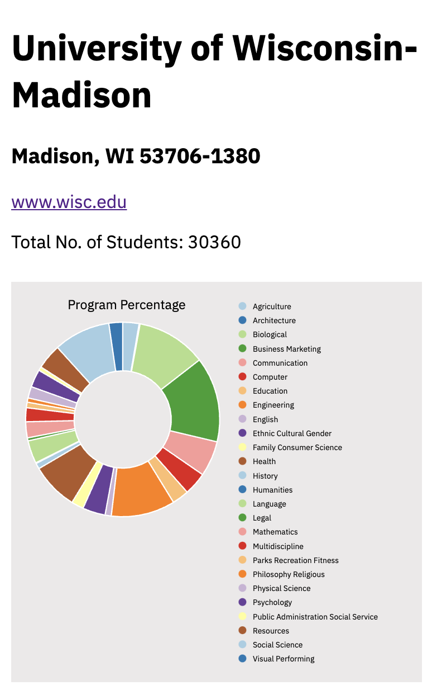

# School Data App

This application pulls and displays data from the College Scorecard API. 

## Installation and Setup

Installation:

```npm install```

Start Server:

```npm run start```

## Usage



## Contributing
Pull requests are welcome.

## License
MIT &copy; Michael Hood